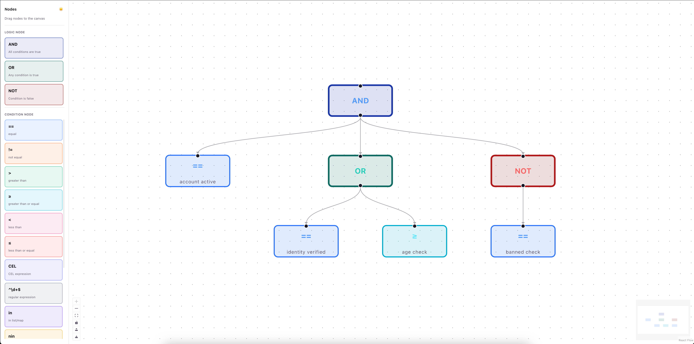
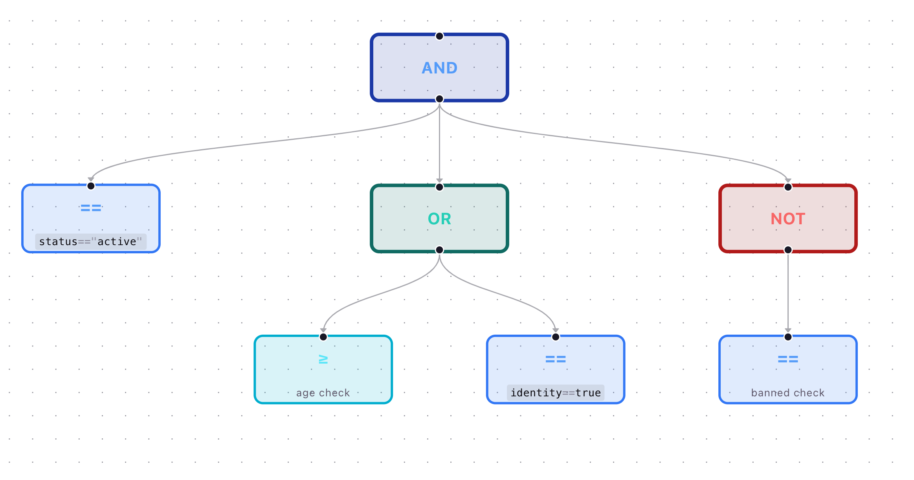
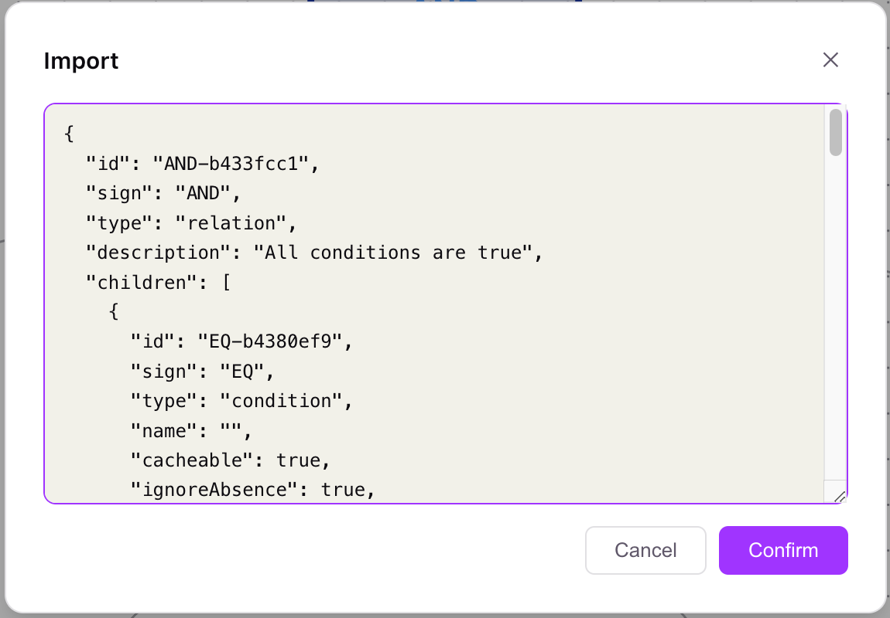
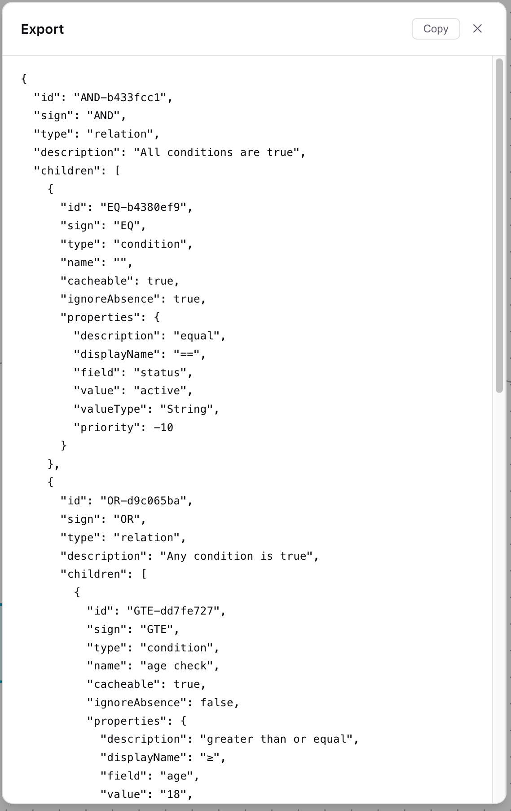

# celero-ui

A visual editor for building and exporting the tree-based rule data structures consumed by [celero](https://github.com/franklee-labs/celero) and [celero-go](https://github.com/franklee-labs/celero-go).

## Overview

celero-ui lets you compose rule trees by dragging nodes onto a canvas, connecting them, and exporting the result as JSON. The exported JSON is directly compatible with the rule engine format expected by celero and celero-go.

## Screenshots



The left sidebar lists all available node types. Drag any node onto the canvas, then draw edges between nodes to build the tree.



The canvas renders the tree with colour-coded nodes for each sign — AND (blue), OR (teal), NOT (red), and condition nodes in their respective colours.

| Import | Export |
| ------ | ------ |
|  |  |

Paste existing rule JSON into the Import dialog to restore a tree with automatic layout. The Export dialog validates the tree and copies the JSON to your clipboard.

## Node types

**Logic (relation) nodes** — combine child conditions using boolean logic:

| Node | Meaning |
| ---- | ------- |
| `AND` | All child conditions must be true |
| `OR` | At least one child condition must be true |
| `NOT` | Single child condition must be false |

**Condition nodes** — evaluate a single predicate against a field or expression:

| Node | Description |
| ---- | ----------- |
| `EQ` / `NEQ` | Equal / not equal |
| `GT` / `GTE` | Greater than / greater than or equal |
| `LT` / `LTE` | Less than / less than or equal |
| `IN` / `NIN` | In / not in a list or map |
| `INTERSECT` / `DISJOINT` | Two lists share / share no common elements |
| `EXISTS` / `ABSENT` | Field exists / does not exist |
| `REGEX` | Field value matches a regular expression |
| `CEL` | Arbitrary [CEL](https://cel.dev) expression |

## JSON format

The exported JSON is a recursive tree. Relation nodes carry a `children` array; condition nodes carry a `properties` object.

### Relation node

```json
{
  "id": "root",
  "type": "relation",
  "sign": "AND",
  "name": "my rule",
  "children": [ ... ]
}
```

### Condition node

```json
{
  "id": "cond-1",
  "type": "condition",
  "sign": "EQ",
  "name": "age check",
  "cacheable": false,
  "ignoreAbsence": false,
  "properties": {
    "field": "user.age",
    "value": "18",
    "valueType": "Number"
  }
}
```

### Full example

The tree shown in the screenshots above exports as:

```json
{
  "id": "AND-b433fcc1",
  "sign": "AND",
  "type": "relation",
  "description": "All conditions are true",
  "children": [
    {
      "id": "EQ-b4380ef9",
      "sign": "EQ",
      "type": "condition",
      "name": "",
      "cacheable": true,
      "ignoreAbsence": true,
      "properties": {
        "description": "equal",
        "displayName": "==",
        "field": "status",
        "value": "active",
        "valueType": "String",
        "priority": -10
      }
    },
    {
      "id": "OR-d9c065ba",
      "sign": "OR",
      "type": "relation",
      "description": "Any condition is true",
      "children": [
        {
          "id": "GTE-dd7fe727",
          "sign": "GTE",
          "type": "condition",
          "name": "age check",
          "cacheable": true,
          "ignoreAbsence": false,
          "properties": {
            "description": "greater than or equal",
            "displayName": "≥",
            "field": "age",
            "value": "18",
            "valueType": "Number",
            "priority": 3
          }
        },
        {
          "id": "EQ-f5f25c31",
          "sign": "EQ",
          "type": "condition",
          "name": "",
          "cacheable": false,
          "ignoreAbsence": true,
          "properties": {
            "description": "equal",
            "displayName": "==",
            "field": "identity",
            "value": "true",
            "valueType": "Boolean",
            "priority": 10
          }
        }
      ]
    },
    {
      "id": "NOT-377af4d9",
      "sign": "NOT",
      "type": "relation",
      "description": "Condition is false",
      "children": [
        {
          "id": "EQ-175115d1",
          "sign": "EQ",
          "type": "condition",
          "name": "banned check",
          "cacheable": false,
          "ignoreAbsence": false,
          "properties": {
            "description": "equal",
            "displayName": "==",
            "field": "banned",
            "value": "true",
            "valueType": "Boolean",
            "priority": 0
          }
        }
      ]
    }
  ]
}
```

## Condition node fields

Each condition sign uses a different set of `properties` fields:

| Sign | Required properties |
| ---- | ------------------- |
| `EQ` `NEQ` `GT` `GTE` `LT` `LTE` | `field`, `value`, `valueType` (`Expression` \| `String` \| `Number` \| `Boolean`) |
| `IN` `NIN` | `field`, `value`, `valueType` (`Expression` \| `List`) |
| `INTERSECT` `DISJOINT` | `list1`, `valueType1`, `list2`, `valueType2` (`List` \| `Expression`) |
| `EXISTS` `ABSENT` | `field` |
| `REGEX` | `field`, `value` |
| `CEL` | `expression` |

All condition nodes also support these top-level flags (configurable in the Advanced panel):

| Flag | Type | Default | Meaning |
| ---- | ---- | ------- | ------- |
| `cacheable` | boolean | `false` | Allow the rule engine to cache this condition's result |
| `ignoreAbsence` | boolean | `false` | Treat a missing field as if the condition passed |
| `priority` | integer | `0` | Evaluation priority; valid range is `Integer.MIN_VALUE` (−2 147 483 648) to `Integer.MAX_VALUE` (2 147 483 647). Exported inside `properties`. |

## Structural constraints

The editor enforces these rules at export time:

| Node | Constraint |
| ---- | ---------- |
| `AND` | At least 1 child |
| `OR` | At least 2 children |
| `NOT` | Exactly 1 child |
| Condition node | No children allowed |
| Tree | Exactly 1 root (no cycles, no disconnected components) |

## Features

- **Drag-and-drop canvas** — drag nodes from the sidebar onto the canvas, then draw edges to connect them into a tree.
- **Node editor** — double-click any node to edit its fields (field path, value, value type, optional display name, `cacheable`, `ignoreAbsence`).
- **Export to JSON** — validates the tree (checks for cycles, correct child counts, required fields) and emits the JSON format used by celero / celero-go.
- **Import from JSON** — paste existing rule JSON to restore the tree on the canvas with automatic layout.
- **Dark / light theme** — toggle via the button in the sidebar header.

## Getting started

```bash
npm install
npm run dev
```

The app opens at `http://localhost:5173` and navigates to `/rule/create` automatically.

### Build

```bash
npm run build
```

Output is written to `dist/`.

## Tech stack

- [React 19](https://react.dev) + TypeScript
- [Vite 8](https://vite.dev)
- [@xyflow/react](https://reactflow.dev) — canvas and edge rendering

## Related projects

| Project | Description |
| ------- | ----------- |
| [franklee-labs/celero](https://github.com/franklee-labs/celero) | Java implementation of the rule engine |
| [franklee-labs/celero-go](https://github.com/franklee-labs/celero-go) | Go implementation of the rule engine |

## License

See [LICENSE](LICENSE).
